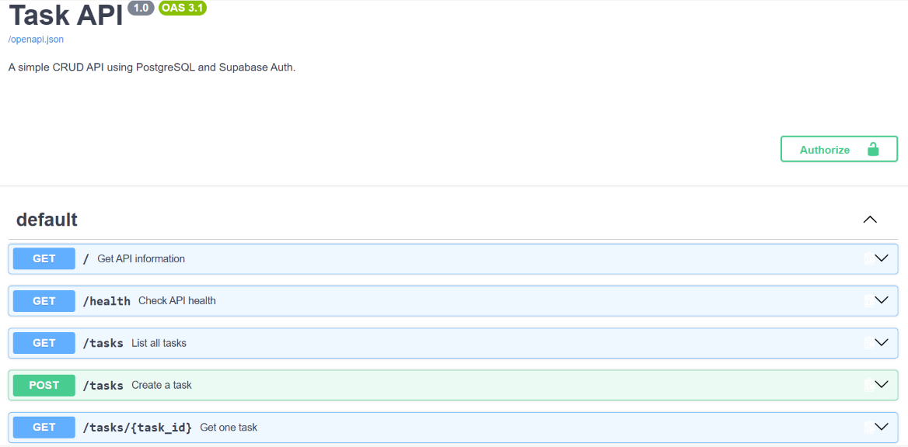

# Task API

A secure backend API built with **FastAPI**, **PostgreSQL**, and **Supabase Auth**.

The project provides CRUD operations for tasks and demonstrates user authentication with signup, login, logout, JWT token verification, protected routes, and Swagger UI documentation.

## Features

- FastAPI backend
- PostgreSQL database
- Supabase Authentication
- User signup and login
- JWT access token authentication
- Protected API routes
- Reusable authentication dependency
- Public API route
- Task CRUD operations
- Swagger UI documentation
- Docker and Docker Compose support
- Environment variables for secrets

## Tech Stack

- Python 3.12
- FastAPI
- PostgreSQL 16
- Supabase Auth
- Psycopg
- Docker
- Docker Compose

## Project Structure

```text
.
├── Dockerfile
├── docker-compose.yml
├── main.py
├── repository.py
├── service.py
├── supabase_client.py
├── init.sql
├── requirements.txt
├── .dockerignore
├── .env.example
├── .gitignore
└── README.md
```

## Environment Setup

Create a `.env` file in the project root.

Use your own Supabase project credentials:

```env
SUPABASE_URL=your_supabase_project_url
SUPABASE_KEY=your_supabase_anon_key
PORT=8000
```

Never commit the `.env` file to GitHub.

The `.env` file is included in `.gitignore`.

## Running the API

Make sure Docker Desktop is running.

Start the application with:

```bash
docker compose up --build
```

The API will be available at:

```text
http://localhost:8000
```

Swagger UI: 

```text
http://localhost:8000/docs
```

## API Reference

| Method | Endpoint | Authentication |
|---|---|---|
| GET | `/` | Public |
| GET | `/health` | Public |
| GET | `/tasks` | Public |
| GET | `/tasks/{task_id}` | Public |
| POST | `/tasks` | Public |
| PUT | `/tasks/{task_id}` | Public |
| DELETE | `/tasks/{task_id}` | Public |
| POST | `/auth/signup` | Public |
| POST | `/auth/login` | Public |
| POST | `/auth/logout` | Required |
| GET | `/public/info` | Public |
| GET | `/protected/profile` | Required |
| GET | `/protected/dashboard` | Required |

## Authentication Flow

### 1. Sign Up

Create a new account:

```http
POST /auth/signup
```

Request:

```json
{
  "email": "test@example.com",
  "password": "password123"
}
```

A successful signup returns HTTP `201`.

### 2. Log In

Log in with the account:

```http
POST /auth/login
```

Request:

```json
{
  "email": "test@example.com",
  "password": "password123"
}
```

A successful login returns an access token and refresh token:

```json
{
  "access_token": "your-jwt-access-token",
  "refresh_token": "your-refresh-token"
}
```

### 3. Access a Protected Route

Protected routes require the access token in the `Authorization` header:

```http
Authorization: Bearer YOUR_ACCESS_TOKEN
```

For example:

```http
GET /protected/profile
```

A valid token returns the authenticated user's information.

An invalid or expired token returns HTTP `401`.

### 4. Logout

Logout requires authentication:

```http
POST /auth/logout
```

A successful logout returns HTTP `204`.

## Protected Routes

The following routes require a valid Supabase access token:

```text
GET /protected/profile
GET /protected/dashboard
POST /auth/logout
```

Authentication is handled through a reusable FastAPI dependency that extracts and verifies the Bearer token using Supabase Auth.

## Status Codes

| Status | Meaning |
|---|---|
| `200` | Request successful |
| `201` | Resource created |
| `204` | Successful request with no response body |
| `400` | Invalid or missing input |
| `401` | Missing, invalid, or expired authentication |
| `404` | Resource not found |

## Swagger UI

The API includes automatically generated Swagger documentation.

Open:

```text
http://localhost:8000/docs
```

The protected routes use Bearer Token authentication.

Click the **Authorize** button in Swagger UI and enter your Supabase access token.

Example:

```text
Bearer YOUR_ACCESS_TOKEN
```

You can then use **Try it out** to test the protected endpoints.

### Swagger Screenshot

Add your Swagger screenshot to the project as:

```text
swagger.png
```

Then it will appear here:


## Security

Sensitive credentials are stored in environment variables.

The `.env` file is ignored by Git:

```text
.env
```

Supabase is responsible for authentication and issuing JWT access tokens.

The backend verifies the access token before allowing access to protected routes.

No Supabase credentials or secrets should be committed to the repository.

## Database

PostgreSQL is used to store task data.

Docker Compose creates a persistent PostgreSQL volume so database data is retained between container restarts.

## Testing the Public Route

```bash
curl http://localhost:8000/public/info
```

Expected response:

```json
{
  "message": "Welcome stranger! This info is public."
}
```

## Testing Authentication

### Login

```bash
curl -X POST http://localhost:8000/auth/login \
  -H "Content-Type: application/json" \
  -d '{"email":"test@example.com","password":"password123"}'
```

Copy the returned `access_token`.

### Access Protected Profile

```bash
curl http://localhost:8000/protected/profile \
  -H "Authorization: Bearer YOUR_ACCESS_TOKEN"
```

A valid token should return the authenticated user's profile.

### Test an Invalid Token

Changing one character of the access token should cause the protected endpoint to return:

```json
{
  "detail": "Invalid or expired token"
}
```

with HTTP status `401`.

## Assignment Progress

- [x] Stage 0 — Setup Supabase and server
- [x] Stage 1 — Signup and login routes
- [x] Stage 2 — Public and protected routes
- [x] Stage 3 — Token verification
- [x] Stage 4 — Authentication dependency and logout
- [x] Stage 5 — Swagger UI with Bearer authentication
- [x] Stage 6 — Publish to GitHub

## How to Run

A peer can run the project with:

```bash
docker compose up --build
```

Then open:

```text
http://localhost:8000/docs
```

Create a Supabase account, log in, copy the access token, click **Authorize**, and test the protected endpoints.

## Author

Backend AI Engineering — Auth Login & Protect Assignment